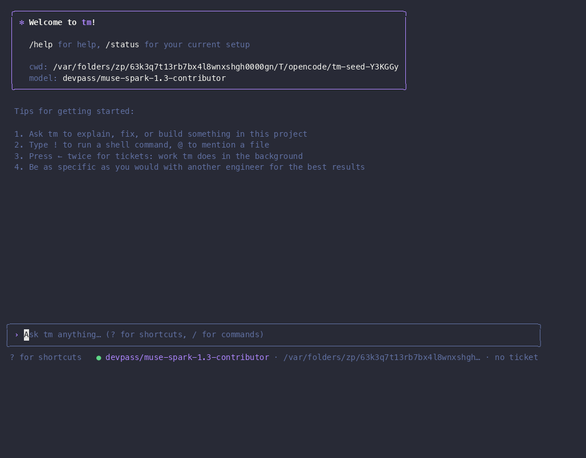
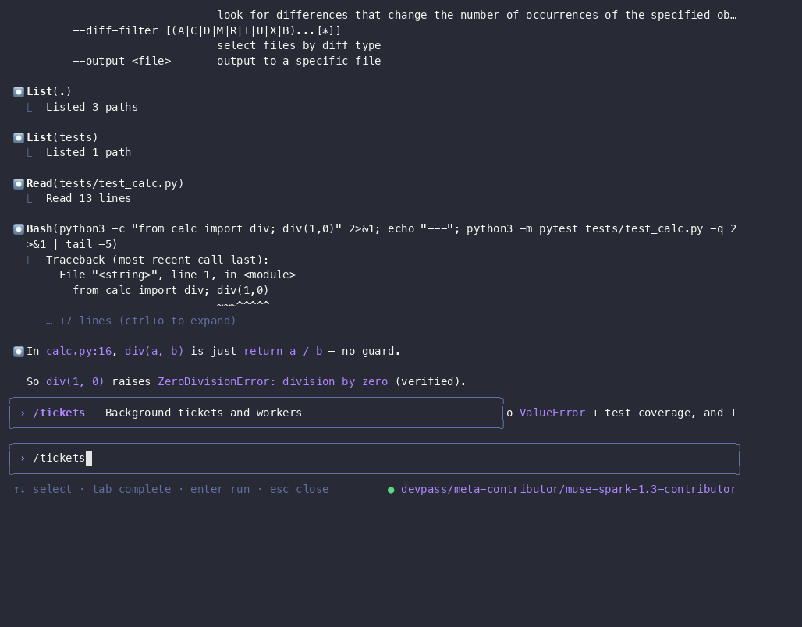
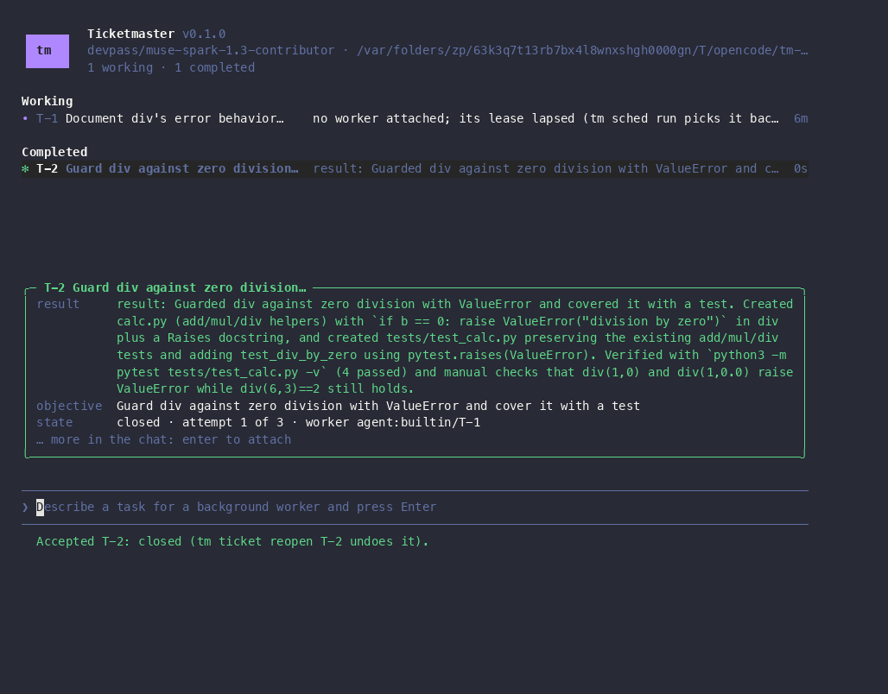

<div align="center">

# 🎟️ Ticketmaster (`tm`)

### The interactive coding agent with a ticket-powered background crew

[](https://github.com/alliecatowo/ticket-master/actions/workflows/ci.yml)


[](#-license)


Chat with an agent live in your terminal — then hand follow-up work to background
workers as **tickets**, review their submissions, and keep shipping.

**[📸 Showcase](#-showcase)** · **[⚡ Quickstart](#-quickstart)** · **[🎛️ Slash commands](#%EF%B8%8F-slash-commands)**
· **[🤖 Providers](#-providers)** · **[🗺️ Docs map](#%EF%B8%8F-docs-map)**

</div>

---

## 📸 Showcase

> Every clip below is the **real `tm` binary** (`v0.1.0`) driven against a disposable
> project with a **live provider** — no mocks, no scripted turns.
> Full session + reproduction notes: [`docs/showcase/`](docs/showcase/).



<details>
<summary><b>🎬 More clips — accept a submission, dispatch a background worker</b></summary>
<br/>

| Review: peek + accept | Dispatch: worker runs live |
| --- | --- |
|  |  |
| `/tickets` → `Space` peek → `1` accept | dispatch input → worker verifies in the row |

Prefer video? Same clips as WebM:
[`tui-live.webm`](docs/showcase/tui-live.webm) ·
[`tui-accept.webm`](docs/showcase/tui-accept.webm) ·
[`tui-dispatch.webm`](docs/showcase/tui-dispatch.webm) ·
full session [`tui-live.cast`](docs/showcase/tui-live.cast) (`asciinema play` it).

</details>

---

## 📦 Install

<details open>
<summary><b>Option A — download a release (recommended)</b></summary>
<br/>

Prebuilt `tm` binaries ship with every [GitHub release](https://github.com/alliecatowo/ticket-master/releases).
Releases after `v0.1.0` also bundle the built web client (`tm serve` finds it next to the binary,
so no separate `pnpm build` step is needed after installing that way).
Release assets are public, so a plain `curl` works (or use `gh release download`):

```sh
curl -fLO https://github.com/alliecatowo/ticket-master/releases/download/v0.1.0/tm-aarch64-apple-darwin.tar.gz
tar -xzf tm-aarch64-apple-darwin.tar.gz
./tm-aarch64-apple-darwin/tm --version && ./tm-aarch64-apple-darwin/tm init
```

That is the `v0.1.0` layout (binary at `tm-aarch64-apple-darwin/tm`). Releases after `v0.1.0`
move it to `tm-<target-triple>/bin/tm` next to a bundled `share/tm/web/`.

Or let `scripts/install.sh` do the download, checksum verification (when the release carries a `.sha256`; `v0.1.0`
doesn't) and layout for you, into
`${PREFIX:-$HOME/.local}`:

```sh
gh auth login   # once -- the script downloads via the gh CLI
scripts/install.sh
```

`mise run release` builds the same tarball layout locally (for testing a release before tagging,
or a target the matrix below doesn't cover yet). See [`docs/install.md`](docs/install.md) for the
full guide: upgrading, uninstalling, and installing from a local tarball.

> **Platform status:** `v0.1.0` ships only a macOS arm64 binary (`tm-aarch64-apple-darwin`).
> On Linux, build from source (Option B). `tm-computer` has compiled on Linux since
> `b01efda` (after `v0.1.0` was tagged); the release matrix already builds both targets, so the
> `x86_64-unknown-linux-gnu` asset attaches automatically from the next tag.
>
> **Asset layout:** `v0.1.0`'s asset has the binary directly at `tm-aarch64-apple-darwin/tm` and
> bundles no web client. The `bin/tm` + `share/tm/web/` layout starts with the next tag. `scripts/install.sh` handles both layouts.

</details>

<details>
<summary><b>Option B — build from source</b></summary>

Requires Rust 1.85+ ([`mise`](https://mise.jdx.dev/) provides it: `mise install`):

```sh
git clone https://github.com/alliecatowo/ticket-master.git && cd ticket-master
mise install
mise run build            # debug build of just the `tm` binary
./target/debug/tm init
```

Prefer an optimized binary? `mise run build:release` (≈ `cargo build --release -p tm-cli`).

</details>

---

## ⚡ Quickstart

<details open>
<summary><b>Prerequisites</b></summary>

- Rust 1.85+ (managed via [`mise`](https://mise.jdx.dev/): `mise install`)
- One configured provider — e.g. `ANTHROPIC_API_KEY`, or the DevPass trio
  (`DEVPASS_API_KEY` + `DEVPASS_BASE_URL` + `DEVPASS_MODEL`). See [`docs/providers.md`](docs/providers.md).

</details>

```sh
mise run build            # build just the `tm` binary
./target/debug/tm init    # create a project in the current directory
./target/debug/tm         # open the TUI on the chat
```

| Want… | Run… |
| --- | --- |
| One-shot scriptable turn | `tm -p "explain this repo"` |
| Plain linear output (no TUI) | `tm --plain` |
| Tickets as JSON | `tm tickets --json` |
| Health check | `tm doctor` |
| Full gate before you call it done | `mise run verify` |

---

## 🎛️ Slash commands

<details>
<summary><b>Click to expand the full command list</b></summary>

| Command | What it does |
| --- | --- |
| `/help` | Keyboard shortcuts |
| `/clear`, `/resume`, `/compact` | Fresh chat · continue a past one · summarize to free context |
| `/model [name]` | Show or switch the model |
| `/level fast|deep` | Choose the fast or deep chat role |
| `/connect`, `/provider`, `/config` | Set up providers, inspect routing, and view harness settings |
| `/status` | Model, provider, directory, mode and ticket |
| `/cost` | Tokens this session used, turn by turn |
| `/init` | Write an `AGENTS.md` for this project |
| `/bg [task]` | Hand work to a background worker as a ticket |
| `/context` | Token use by section, plus the attached ticket's prefetched context |
| `/todos` | Toggle the task checklist |
| `/tickets` | Background tickets and workers |
| `/attach <ticket>`, `/detach` | Tie this chat to a ticket (or untie it) |
| `/decide <text>` | Record a project decision |
| `/exit` | Quit |

</details>

`/level` is an interactive chat command only; there is no noninteractive CLI tier-setting
command. Use `/level fast` or `/level deep` in chat; deep requires a configured `coder.deep`
provider/model route and reports an actionable error when none exists. `tm ticket dispatch "..."` creates
and activates a worker ticket; `tm ticket new` alone creates a draft, which must be activated.

<details>
<summary><b>⌨️ Keyboard highlights</b></summary>

- `/` commands · `?` shortcuts · `!` shell mode · `@` file paths · `←` `←` tickets
- `Enter` send · `Shift+Enter` newline · `↑`/`↓` history · `Ctrl+R` search history
- `Ctrl+O` transcript · `Ctrl+T` tasks · `Shift+Tab` cycle auto/plan/ask · `Esc` interrupt

</details>

---

## 🤖 Providers

`tm` routes turns through a provider fabric — **21 backends** (Anthropic, OpenAI,
OpenRouter, GitHub Models, Gemini, Ollama/LM Studio/llama.cpp local, Azure, Bedrock,
Vertex, Cloudflare, DevPass, …).

```sh
tm provider detect   # which backends are configured in THIS environment
tm provider list     # role → candidate routing from providers.toml
tm provider default                  # show the project's default model
tm provider default ollama/qwen2.5-coder  # set it; `clear` removes it
tm provider test devpass  # one tiny billed smoke test
```

`tm init` creates project-scoped `harness.toml` (harness behavior) and `providers.toml`
(provider role routing). `tm harness set` validates and persists a candidate; promote the resulting
harness epoch to apply it. Chat model defaults are stored separately in `default-model.json`.
Sessions and background workers use the same project provider table;
local backends require a concrete model route in `providers.toml`; tm does not guess a local model.
`tm provider list` reports configured routing candidates, not whether credentials are present
or a model can answer; use `tm provider detect` for environment availability and `tm provider test`
for a real (potentially billed) round trip. Saving a default model does not verify service access.

Full matrix and configuration details: [`docs/providers.md`](docs/providers.md).

---

## 🗺️ Docs map

<details>
<summary><b>Where everything lives</b></summary>

| Path | What's there |
| --- | --- |
| [`SPEC.md`](SPEC.md) | Binding project philosophy (§0) + full spec |
| [`docs/install.md`](docs/install.md) | Full install guide: release download, `scripts/install.sh`, source, provider setup |
| [`docs/decisions/`](docs/decisions/) | Architecture decision records (`D-NNN`) |
| [`docs/providers.md`](docs/providers.md) | Provider matrix + wire-name mapping |
| [`docs/showcase/`](docs/showcase/) | Real TUI recordings + friction log |
| [`docs/wiki/`](docs/wiki/) | Generated docs (regenerate: `mise run docs:wiki`) |
| [`docs/backlog.md`](docs/backlog.md) | What's parked / what's next |
| [`CLAUDE.md`](CLAUDE.md) | Dev-workflow bible: mise tasks, worktrees, TUI reference |

</details>

## 📄 License

Licensed under either of [MIT](LICENSE-MIT) or [Apache-2.0](LICENSE-APACHE), at your option.

---

<div align="center">

`mise run verify` is the gate: fmt check + `clippy -D warnings` + workspace tests + hygiene.
Run it before considering any change done. ✅

</div>
