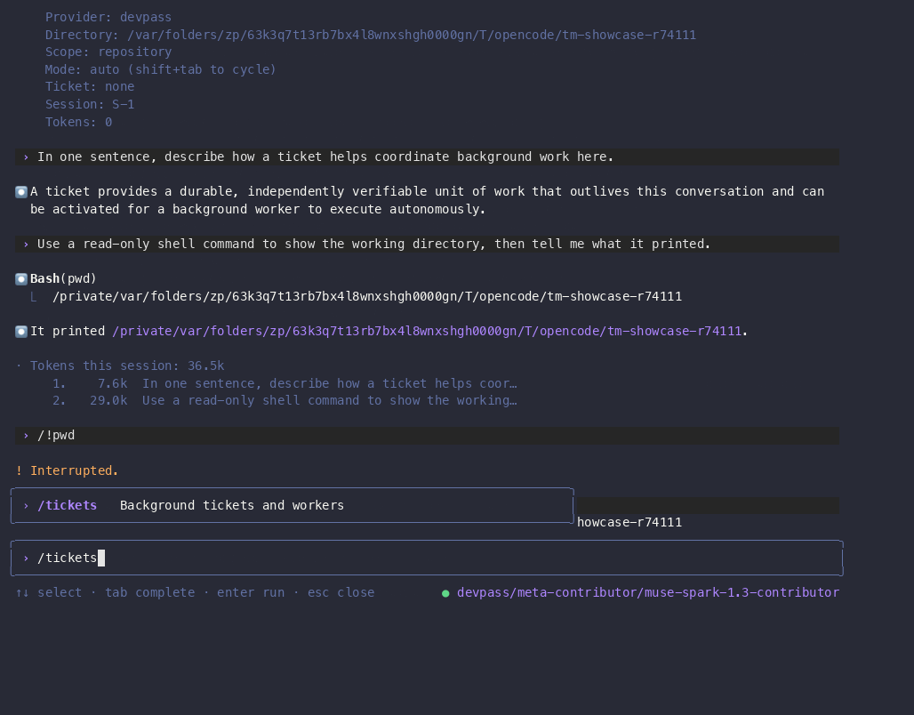
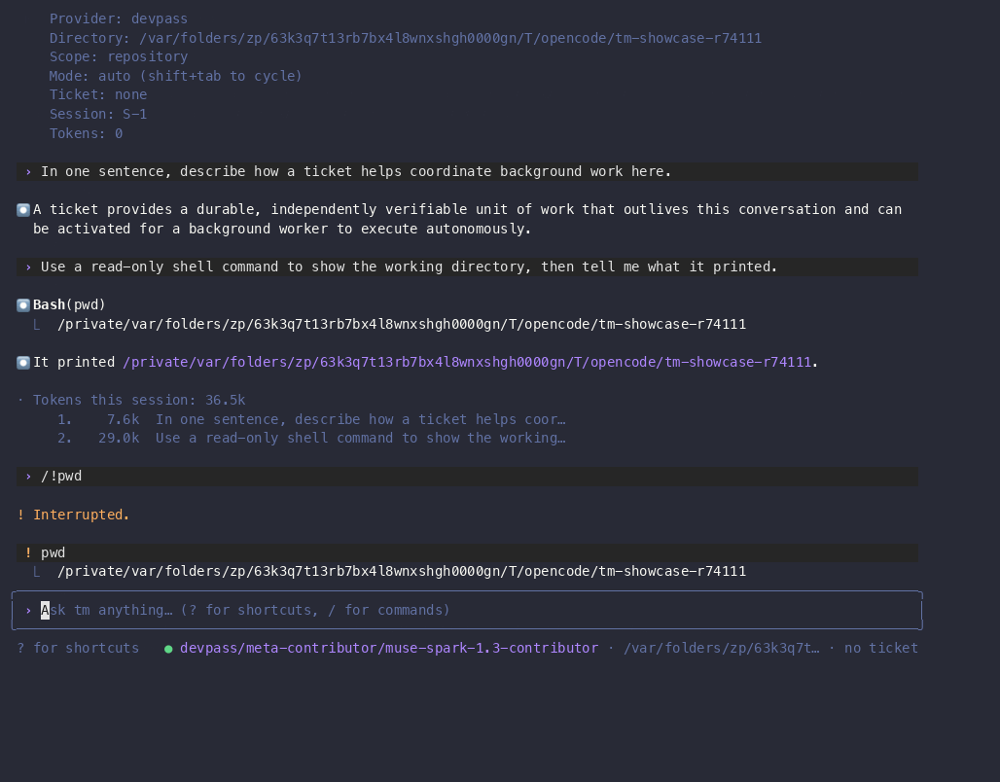

# TUI showcase

Real recordings of the `tm` terminal UI, driven against a disposable project with the
**live configured provider** (`devpass/muse-spark-1.3-contributor`). No mocks, no scripted
fake turns: every model answer, tool call, and screen in these clips is the actual TUI build
at commit `faecfd3` (`tm 0.1.0`).

## Playback

- Full session: [`tui-hero.cast`](tui-hero.cast) (~4m50s) — `asciinema play docs/showcase/tui-hero.cast`.
- GIFs below are excerpts of that cast, cut with `agg --select`; `.webm` files are the same
  clips encoded with `ffmpeg` (VP9) for smaller size.

## Gallery

### Hero: status, live turn, live tool use


Cast `4s..58s`. Opens on the `/` command popup, runs `/status` (the rendered
Model/Provider/Directory/Scope/Mode/Ticket/Session/Tokens panel), asks a question answered live by the configured
provider, then asks for a read-only `pwd` and shows the `Bash(pwd)` tool call with its real
output followed by the model's spoken answer. Same clip as video: [`tui-hero.webm`](tui-hero.webm).

### Tickets screen, shortcuts, Kanban board



Cast `236s..264s`. `/tickets` opens the tickets screen on an empty project ("no tickets
yet"), `?` opens the tickets shortcuts overlay (peek, accept/reject/retry, cancel, Kanban),
`Ctrl+B` opens the Kanban board (first columns `Draft/Blocked/Ready/Leased`, all zero), `Esc` returns.
Same clip as video: [`tui-tickets.webm`](tui-tickets.webm).

### Transcript viewer and task checklist



Cast `270s..286s`. `Ctrl+O` opens the transcript viewer over the finished turns (tool
input/output included), `Esc` closes it, `Ctrl+T` shows the task checklist ("No tasks yet"
— nothing was dispatched; see friction note 5). Same clip as video:
[`tui-transcript-tasks.webm`](tui-transcript-tasks.webm).

## What the full cast covers (with timestamps)

| Cast time | Screen |
| --- | --- |
| 4s | `/` slash-command popup (live filter) |
| 11s | `/status` output |
| 27–38s | Live turn 1: question asked, provider answer streamed |
| 116–128s | Live turn 2 with tool use: `Bash(pwd)` runs, real output, spoken answer |
| 147s | `/model` picker (`devpass/muse-spark-1.3-contributor`, marked current) |
| 157s | `/cost` per-turn token table |
| 204–216s | Mistyped `/!pwd` submitted, turn interrupted with `Esc` (friction note 1) |
| 230s | `!pwd` shell mode: output joins the conversation without a model turn |
| 237s | Tickets screen, empty state |
| 242s | Tickets `?` shortcuts overlay |
| 261s | Kanban board (`Ctrl+B`), empty |
| 275s | Transcript viewer (`Ctrl+O`) |
| 280s | Task checklist (`Ctrl+T`), empty |
| 288s | `/exit` quits cleanly to the shell |

## Reproduction

```sh
mise run build
export TM_SHOWCASE="$(mktemp -d /tmp/tm-showcase-XXXXXX)"
./target/debug/tm init --fresh "$TM_SHOWCASE"
# Start the recorder BEFORE launching the TUI (friction note 4), keep all other
# PTY sessions idle while it runs (friction note 3):
./target/debug/tm --project "$TM_SHOWCASE"
```

Then in the TUI: `/status`, ask something, `!pwd`, `/model`, `/cost`, `/tickets`, `?`,
`Ctrl+B`, `Esc`, `Esc`, `Ctrl+O`, `Esc`, `Ctrl+T`, `/exit`. Convert with
`agg --idle-time-limit 2 --fps-cap 10 --font-size 14 --select A..B in.cast out.gif`.

## Friction and incomplete coverage found along the way

1. **`Esc` closes the `/` popup but leaves `/` in the input.** Typing `!pwd` immediately
   after submits `/!pwd` as an unknown command and starts a (billed) provider turn; it was
   interrupted with `Esc`. Press `Esc` twice — once to close the popup, once to clear the
   input — before switching to `!` shell mode.
2. **Tickets/kanban/transcript/tasks shown empty only.** No ticket was dispatched on camera,
   so accept/reject/retry, peek-with-content, and worker progress states are not demonstrated.
   Dispatching a real background worker on camera is left as a follow-up (it costs provider
   time and makes the recording non-deterministic).
3. **`startRecording` captures every PTY session in the process, not just the TUI one.**
   Anything typed in a sibling session during the capture lands in the same cast. Keep other
   sessions idle while recording.
4. **Recording starts at "new output", not "current screen".** The welcome banner rendered
   before recording started is absent from the cast — start the recorder first, then launch
   the TUI, to capture it.
5. **Prompt PII at the shell boundary.** After `/exit`, the shell prompt (hostname, username,
   email) is captured. The published cast is trimmed at `289.7s` (before the post-exit shell
   redraw) for exactly this reason; check with `grep -c gmail` before publishing.
6. **Requested `openai/gpt-6-luna` worker was not used.** The model exists in this machine's
   OpenCode model list, but a nested worker session had no PTY/recording tools and could not
   capture anything, so the showcase was driven directly instead. The TUI chat itself answers
   through the repo-configured live provider (`devpass/...` here) — it cannot be pointed at an
   arbitrary OpenCode model without that provider's credentials in the environment.
